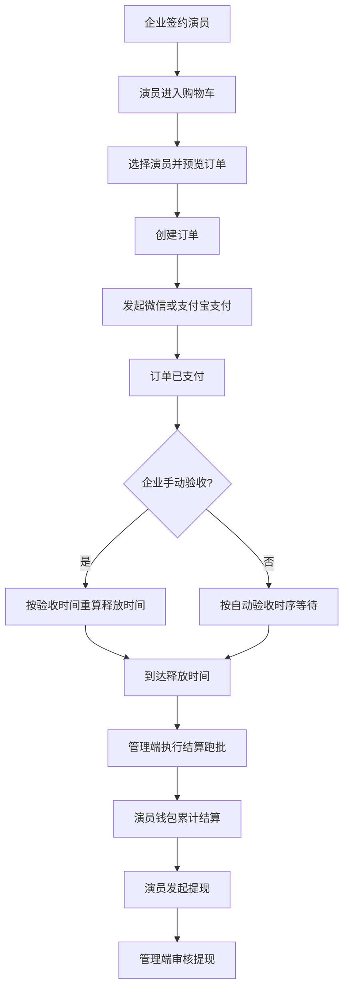

# 支付与结算产品需求文档（PRD）

- 文档名称：企业签约电商化支付与结算 PRD
- 文档版本：v1.0
- 文档状态：待评审
- 更新时间：2026-04-21
- 适用系统：Actor Manager（企业端、演员端、管理端）
- 对齐实现：当前主干代码（含 Mock 微信/支付宝、退款、结算、提现闭环）

---

## 1. 文档目标

本 PRD 用于统一以下目标：

1. 将“企业签约演员”的合作流程产品化为标准电商支付链路。
2. 让企业可以完成“选人-下单-支付-验收-退款”的完整闭环。
3. 让演员可以看到“签约企业付款情况”、查看可提现金额并发起提现。
4. 让平台（管理端）可配置手续费、处理退款、审核提现、触发结算。
5. 在未接入真实微信/支付宝前，通过 Mock 支付保证全链路可测试、可验收。

---

## 2. 背景与问题定义

### 2.1 业务背景

当前平台业务核心是“企业购买演员授权服务”。该流程具备典型电商特征：

1. 有明确交易标的（演员服务）。
2. 有企业付款与平台抽佣。
3. 有交付后结算给演员。
4. 存在退款、争议、审核、资金安全要求。

### 2.2 当前要解决的问题

1. 之前签约与支付链路割裂，缺少统一下单入口。
2. 缺少购物车、费用预览、支付状态、退款和结算状态的标准化展示。
3. 演员端缺少可提现余额与提现操作，资金闭环不完整。
4. 平台手续费比例、支付时序参数无法统一管理。
5. 真实支付未开通，联调困难，需要 Mock 覆盖真实流程。

---

## 3. 产品目标与成功指标

### 3.1 产品目标

1. 企业侧完成“签约后直接进购物车”的顺滑路径。
2. 企业侧支持微信/支付宝两种支付通道（当前 Mock，后续可无缝替换真实网关）。
3. 管理端支持退款发起与审核、提现审核、结算跑批、手续费配置。
4. 演员侧支持付款可见、余额可见、提现可操作。
5. 可提现金额与企业支付/退款/结算逻辑严格闭环。

### 3.2 核心业务指标（建议）

1. 支付转化率：创建订单后 24h 内完成支付的占比。
2. 支付成功率：支付单发起后状态为 `paid` 的占比。
3. 退款处理时效：退款申请到审核完成的中位时长。
4. 结算及时率：到期应结算条目在 T+1 天内完成结算的占比。
5. 提现审核时效：提现申请到审核完成的中位时长。
6. 资金一致性：可提现余额负数事件为 0。

---

## 4. 角色与权限

| 角色 | 核心能力 |
| --- | --- |
| 企业用户 | 签约演员、管理购物车、预览订单、创建订单、发起支付、查看订单、手动验收 |
| 演员用户 | 查看签约企业付款状态、查看钱包汇总、发起提现、查看提现记录 |
| 管理员 | 配置支付参数、查看订单、发起退款、审核退款、查看提现、审核提现、执行结算跑批 |

权限原则：

1. 企业只能操作自己的购物车和订单。
2. 演员只能查看自己的钱包与提现记录。
3. 管理员拥有跨租户运营权限（退款/提现审核/配置）。

---

## 5. 功能范围

### 5.1 本期范围（已实现）

1. 企业签约后自动尝试入购物车。
2. 购物车增删查、下单预览、创建订单。
3. 微信/支付宝支付发起（Mock 通道）。
4. 企业订单列表与详情、支付记录查看。
5. 企业手动验收（提前触发释放时间重算）。
6. 管理端退款发起与审核。
7. 管理端结算跑批。
8. 演员钱包汇总、提现申请、提现记录。
9. 管理端提现审核（通过/驳回/失败）。
10. 管理端支付配置（手续费率与时序参数）。
11. 企业端签约演员页展示支付状态。
12. 演员端签约企业列表与详情展示付款情况。

### 5.2 本期不做（明确边界）

1. 真实微信支付网关接入（统一下单、回调验签、关单）。
2. 真实支付宝网关接入（统一下单、回调验签、关单）。
3. 自动定时任务系统（当前结算由管理端手动触发跑批接口）。
4. 财务对账后台（渠道账单对账、差异工单）。

---

## 6. 关键用户旅程

---

## 7. 详细功能需求

## 7.1 签约与购物车入口

### 7.1.1 需求描述

1. 企业在演员详情页点击“签约”后，系统创建签约关系。
2. 签约后系统自动确保演员进入企业购物车。
3. 已签约演员支持“加入购物车”按钮；已在购物车时不可重复加入。

### 7.1.2 关键规则

1. 未签约演员不能加入购物车。
2. 同一企业-演员组合在“激活状态”下只能存在 1 条购物车记录。
3. 重复加入返回明确提示：“该演员已在购物车中，请勿重复加入。”

### 7.1.3 验收标准

1. 签约成功后，购物车可见对应演员。
2. 重复加入同演员时，前端提示并且数据不重复。

---

## 7.2 企业购物车与结算页面

### 7.2.1 需求描述

1. 新增独立页面“购物车与结算”。
2. 支持多演员勾选、全选、移除。
3. 实时展示订单预览：演员报价合计、平台手续费、应付总额、手续费率。
4. 支持从预览直接创建订单。

### 7.2.2 关键规则

1. 下单对象必须来自购物车激活条目。
2. 若购物车为空，不可创建订单。
3. 下单后对应购物车条目标记为 `converted`，避免重复下单。

### 7.2.3 验收标准

1. 预览金额与最终订单金额一致。
2. 下单后购物车数量减少，订单列表出现新订单。

---

## 7.3 订单与支付

### 7.3.1 需求描述

1. 企业可查看订单列表和订单详情。
2. 待支付订单支持选择 `wechat` 或 `alipay` 发起支付。
3. 支付成功后订单进入已支付态，并自动计算释放时间。
4. 若支付失败，订单进入支付失败态，可重试支付。

### 7.3.2 Mock 支付要求

1. 配置可切换是否启用 Mock：`payment.use_mock`。
2. 当 `payment.use_mock=true` 且 `payment.mock_channel_auto_success=true`：
   - 发起支付即回写 `paid`，用于全链路联调。
3. 当 `payment.use_mock=true` 且 `auto_success=false`：
   - 支付单保持 `initiated`，返回 mock 支付地址。
4. 当 `payment.use_mock=false` 且无真实网关：
   - 明确报错拒绝支付/退款/结算。

### 7.3.3 通道开关要求

1. 管理端可关闭微信/支付宝通道。
2. 关闭后企业端选择该通道应直接报错，不生成成功支付结果。

---

## 7.4 验收、释放与结算时间

### 7.4.1 需求描述

支付完成后不是立刻给演员打款，需要经过“验收/保护”周期后释放。

### 7.4.2 时间参数（管理端可配置）

1. `auto_accept_hours`：自动验收时长。
2. `dispute_protect_hours`：纠纷保护期。
3. `max_hold_hours`：最大冻结时长。
4. `settlement_safety_buffer_hours`：结算安全缓冲时长。

### 7.4.3 释放时间计算规则

订单支付成功时：

1. `auto_accept_at = paid_at + auto_accept_hours`
2. `release_by_accept = auto_accept_at + dispute_protect_hours`
3. `forced_deadline = paid_at + (max_hold_hours - settlement_safety_buffer_hours)`
4. `release_at = min(release_by_accept, forced_deadline)`

企业手动验收时：

1. 以当前时间重新计算释放时间：
   `release_at = min(now + dispute_protect_hours, forced_deadline)`
2. 允许提前完成交付验收并加速结算。

### 7.4.4 参数建议（默认）

1. 自动验收：72 小时。
2. 纠纷保护：168 小时（7 天）。
3. 最大冻结：4320 小时（180 天）。
4. 结算缓冲：24 小时。

---

## 7.5 结算（支付给演员）

### 7.5.1 需求描述

1. 管理端可触发“到期条目结算跑批”。
2. 跑批只处理已到释放时间且状态允许结算的演员订单条目。
3. 结算成功后累计到订单与演员维度。

### 7.5.2 结算对象筛选规则

需同时满足：

1. `actor_release_at` 非空且 `<= now`。
2. 条目状态为 `paid` 或 `partially_refunded`。
3. 订单状态为 `paid` / `partially_refunded` / `settled`。

### 7.5.3 验收标准

1. 跑批返回处理数、成功数、失败数、逐条结果。
2. 成功条目更新结算金额与状态。
3. 订单结算状态自动重算。

---

## 7.6 退款（管理端）

### 7.6.1 需求描述

1. 管理员可按订单发起退款申请，可选指定演员条目退款。
2. 退款申请创建后进入待审核。
3. 管理员审核退款后调用网关退款，成功则回写订单与条目金额。

### 7.6.2 关键规则

1. 退款金额必须大于 0。
2. 退款总额不得超过订单可退余额。
3. 指定演员退款时不得超过该演员条目可退余额。
4. 退款成功后需同步影响：
   - 订单已退款金额。
   - 订单/条目状态。
   - 演员可结算金额（通过条目快照中的 `actor_refunded_amount` 参与后续计算）。

### 7.6.3 验收标准

1. 退款成功后，订单详情中的退款金额与状态一致。
2. 演员条目的“可结算剩余金额”正确下降。

---

## 7.7 演员端付款可见性

### 7.7.1 需求描述

1. 演员“签约企业列表”显示每个企业的付款状态。
2. 演员“签约企业详情”显示付款情况、最近订单号和金额。
3. 企业“签约演员列表”也显示每个演员的支付状态，确保双向可见。

### 7.7.2 状态口径

可见状态包括：

1. 未下单
2. 待支付
3. 支付失败
4. 已支付待结算
5. 已结算
6. 部分退款
7. 已退款

---

## 7.8 演员钱包与提现

### 7.8.1 需求描述

演员端新增“金额与提现”页，展示：

1. 可提现余额
2. 累计结算
3. 提现处理中金额
4. 累计已提现
5. 失败/驳回金额

并支持发起提现：

1. 选择通道：微信/支付宝。
2. 输入金额、收款人、账号、备注。
3. 查看提现记录与状态。

### 7.8.2 闭环规则（核心）

可提现余额必须与企业支付生命周期一致：

1. 先由订单条目结算形成“净结算金额”。
2. 退款会削减条目可归属演员金额。
3. 可提现余额 = 净结算金额 - 提现处理中 - 已提现。
4. 余额计算不得出现负数。

### 7.8.3 并发安全

1. 创建提现前锁演员行并重算余额。
2. 管理端审核“通过”前再次锁行并二次校验可核准金额。

---

## 7.9 提现审核（管理端）

### 7.9.1 需求描述

管理端提现审核页支持：

1. 状态筛选。
2. 审核动作：`approve` / `reject` / `fail`。
3. 录入失败或驳回原因。

### 7.9.2 审核规则

1. 仅 `pending` / `processing` 状态可审核。
2. 审核通过需再次校验可用余额，防止超额打款。
3. 审核结果写入审计日志和响应快照。

---

## 7.10 支付配置（管理端）

### 7.10.1 需求描述

管理端可配置：

1. 平台手续费率 `fee_rate_bps`。
2. 自动验收时长。
3. 纠纷保护期。
4. 最大冻结时长。
5. 结算安全缓冲。
6. 微信/支付宝通道开关。

### 7.10.2 生效规则

1. 手续费率与规则快照在“创建订单”时固化到订单。
2. 后续修改不追溯历史订单，仅影响新订单。
3. `settlement_safety_buffer_hours` 必须小于 `max_hold_hours`。

---

## 8. 资金规则与计算口径

## 8.1 金额单位

1. 后端统一使用整数金额（分）计算。
2. 前端负责格式化为人民币展示。

## 8.2 平台手续费

1. 订单总手续费：
   `platform_fee_total = actor_total * fee_rate_bps / 10000`（向下取整）
2. 多演员条目按报价比例分摊，最后一条吃尾差。

## 8.3 订单金额关系

1. `payable_total = actor_total + platform_fee_total`
2. 可退款余额：`paid_total - refunded_total`

## 8.4 演员净结算口径

每条演员订单条目：

1. `actor_due_after_refund = actor_quote_amount - actor_refunded_amount`
2. `item_net_settled = min(settled_amount, actor_due_after_refund)`

演员净结算总额：所有条目 `item_net_settled` 求和。

---

## 9. 状态机需求

## 9.1 订单状态

1. `pending_payment`
2. `payment_failed`
3. `paid`
4. `settled`
5. `partially_refunded`
6. `refunded`

## 9.2 订单条目状态

1. `pending`
2. `paid`
3. `settled`
4. `partially_refunded`
5. `refunded`

## 9.3 支付状态

1. `initiated`
2. `paid`
3. `failed`

## 9.4 退款状态

1. `pending`
2. `succeeded`
3. `failed`

## 9.5 结算状态

1. `pending`
2. `settled`
3. `failed`

## 9.6 提现状态

1. `pending`
2. `processing`
3. `succeeded`
4. `failed`
5. `rejected`

---

## 10. 异常与边界场景

1. 未签约加入购物车：拒绝并提示先签约。
2. 重复加入购物车：拒绝并提示避免重复。
3. 订单金额为 0 或异常：禁止支付。
4. 支付通道被管理端关闭：禁止发起。
5. 非法状态操作（如已退款再退款）：拒绝。
6. 退款超额：拒绝并返回可退上限。
7. 提现超余额：拒绝并返回可提上限。
8. 审核时余额变化：二次校验失败则拒绝通过。
9. Mock 关闭但真实网关未接：明确报错提示。
10. JSON 序列化字段包含时间：需统一序列化为 ISO 字符串。

---

## 11. 非功能需求

## 11.1 一致性

1. 涉及金额变更的关键流程必须使用数据库事务。
2. 提现等并发敏感操作必须加行级锁。

## 11.2 可审计

关键动作写入支付审计日志，包括操作者、动作、关联单据、明细。

## 11.3 可观测

1. 支付相关核心路径需有错误日志与审计日志。
2. 管理端操作可追溯至人。

## 11.4 安全

1. 管理端接口仅管理员可访问。
2. 演员/企业数据按身份隔离。
3. 提现账号展示需脱敏。

---

## 12. 页面与入口清单

## 12.1 企业端

1. 演员详情页：签约、加入购物车、前往结算入口。
2. 签约演员页：展示支付状态。
3. 购物车与结算页：购物车、预览、下单、支付、验收、订单详情。

## 12.2 演员端

1. 签约企业列表：付款情况标签。
2. 签约企业详情：付款情况与最近订单。
3. 金额与提现页：钱包汇总、提现申请、提现记录。

## 12.3 管理端

1. 支付配置页：手续费率和时序参数。
2. 提现审核页：审核操作与状态筛选。
3. 订单/退款/结算接口用于运营后台管理动作。

---

## 13. 运营 SOP（建议）

## 13.1 每日例行

1. 早晚两次执行结算跑批。
2. 清理并处理 `pending` 提现单。
3. 处理 `pending` 退款单。

## 13.2 退款 SOP

1. 先确认订单可退额度。
2. 再发起退款申请。
3. 审核通过后核对订单退款金额与状态。

## 13.3 提现 SOP

1. 优先处理历史 `pending` 单据。
2. 审核通过前核对是否超可核准金额。
3. 失败/驳回必须填写原因。

---

## 14. 验收标准（UAT）

## 14.1 企业支付链路

1. 签约后演员自动入购物车。
2. 购物车中同演员不可重复加入。
3. 预览金额、订单金额、支付金额一致。
4. 支付成功后订单转 `paid`。
5. 手动验收后释放时间更新。

## 14.2 退款与结算

1. 支持订单级退款与演员条目级退款。
2. 退款后订单/条目状态正确变化。
3. 到期结算跑批后，订单结算金额与状态正确。

## 14.3 演员端

1. 签约企业页可见付款状态。
2. 钱包汇总字段正确。
3. 提现申请、审核、状态回写完整。

## 14.4 管理端

1. 手续费率可配置并仅影响新订单。
2. 提现审核三种动作均可执行并留痕。
3. 通道开关后企业支付受控。

---

## 15. 版本规划

## 15.1 V1（当前）

1. Mock 支付全链路。
2. 退款/结算/提现闭环。
3. 管理端配置与审核能力。

## 15.2 V2（建议）

1. 接入真实微信支付与支付宝（下单、回调、验签、关单、退款回调）。
2. 增加异步任务调度（自动结算跑批、失败重试、通知）。
3. 加入财务对账中心与异常工单流。

## 15.3 V3（建议）

1. 风控策略（黑名单、频控、大额审批）。
2. 多币种/税务扩展。
3. 更细粒度报表（企业、演员、通道、时间维度）。

---

## 16. 风险与应对

1. 风险：真实支付未接入前无法真实收单。
   - 应对：保持 Mock 与网关适配层隔离，接口模型不变。
2. 风险：运营不跑批导致延迟结算。
   - 应对：短期建立值班 SOP；中期引入定时任务。
3. 风险：退款与提现并发导致余额争抢。
   - 应对：提现创建和审核都加锁并二次校验。
4. 风险：金额口径误解（分/元）。
   - 应对：文档与接口统一声明金额单位。

---

## 17. 附录：业务公式汇总

1. 订单手续费：
   `platform_fee_total = floor(actor_total * fee_rate_bps / 10000)`
2. 订单应付：
   `payable_total = actor_total + platform_fee_total`
3. 自动释放：
   `release_at = min(paid_at + auto_accept_hours + dispute_protect_hours, paid_at + max_hold_hours - settlement_safety_buffer_hours)`
4. 手动验收后释放：
   `release_at = min(now + dispute_protect_hours, paid_at + max_hold_hours - settlement_safety_buffer_hours)`
5. 演员可提现余额：
   `available = net_settled - withdrawing - withdrawn`
6. 演员净结算总额：
   `sum(min(settled_amount, actor_quote_amount - actor_refunded_amount))`

