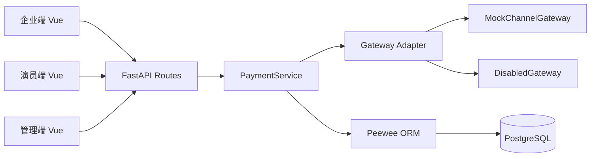
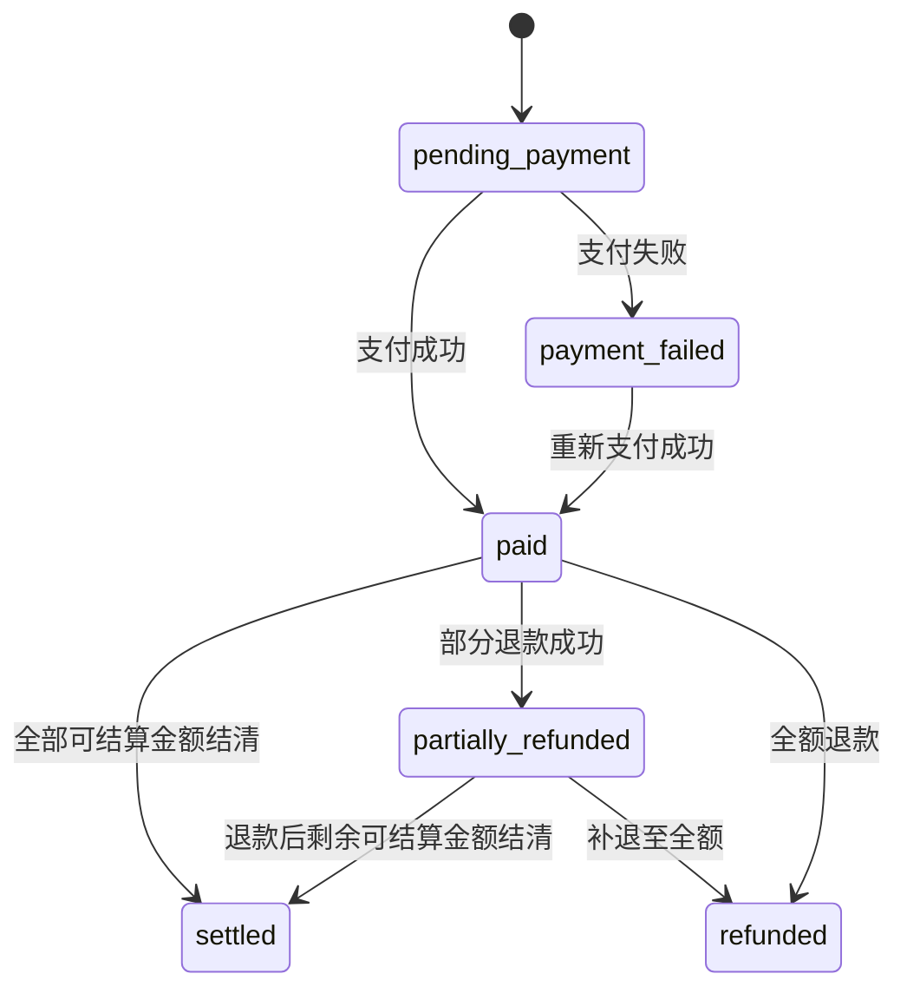
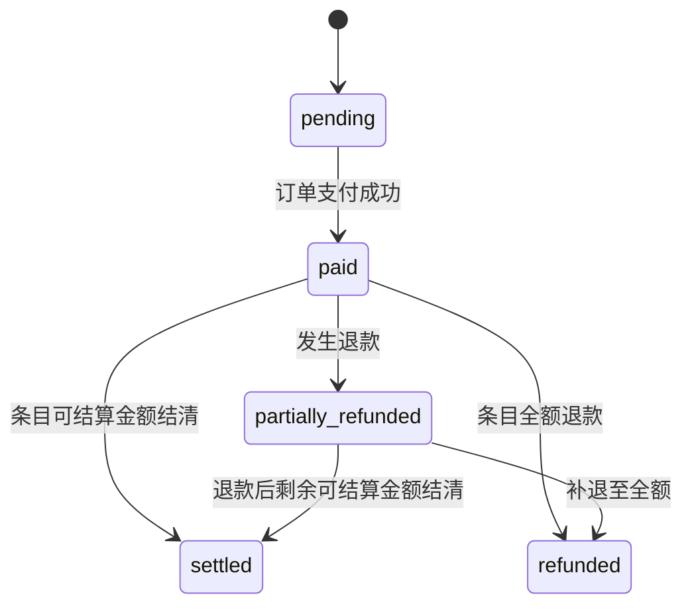
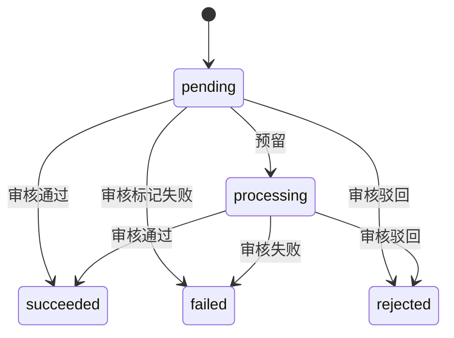
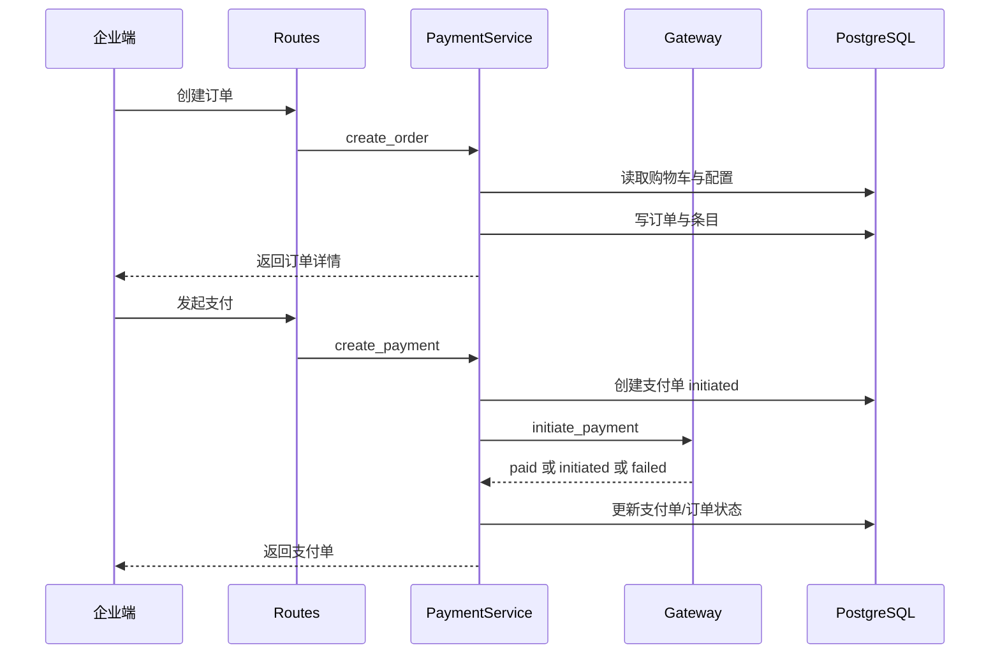
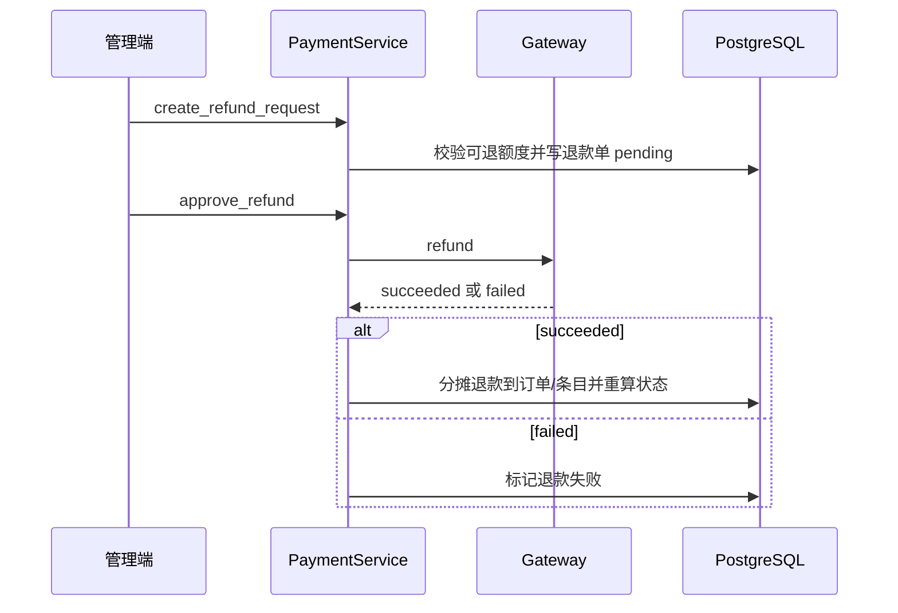
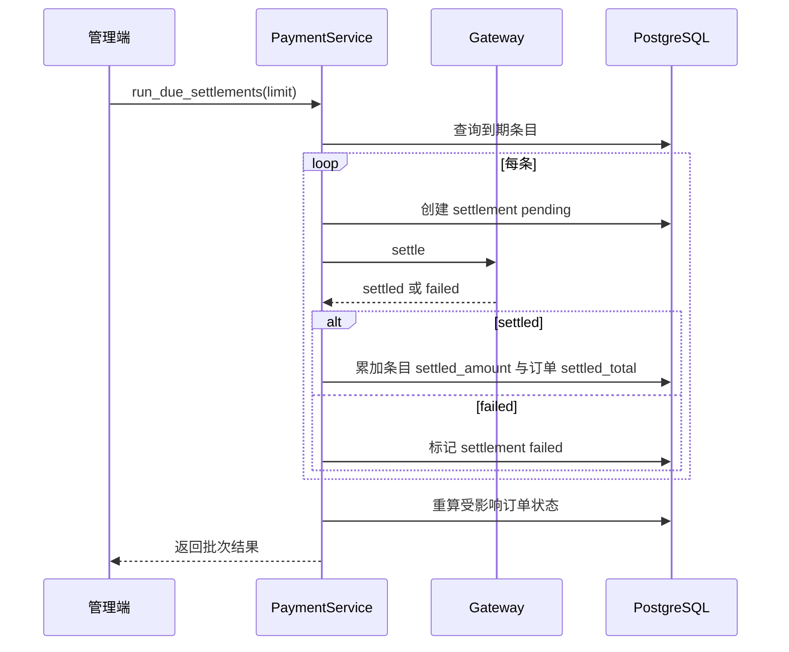
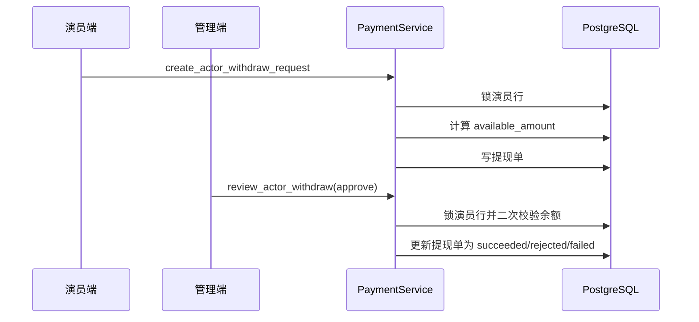

# 支付与结算系统详细技术设计文档

- 文档名称：Actor Manager 支付与结算技术设计
- 文档版本：v1.0
- 更新时间：2026-04-21
- 架构形态：单体后端（FastAPI + Service + Peewee + PostgreSQL）+ Vue 前端
- 设计基线：当前主干已实现功能

---

## 1. 设计目标与约束

## 1.1 设计目标

1. 支持企业侧电商化交易主链路：购物车、下单、支付、验收、结算、退款。
2. 支持演员侧资金可见与提现能力，形成资金闭环。
3. 支持管理端运营动作：参数配置、退款审核、提现审核、结算执行。
4. 在真实网关未接入情况下，通过 Mock 保证全链路可测试。
5. 对未来接入真实微信/支付宝保留清晰的适配层边界。

## 1.2 约束条件

1. 当前无真实微信支付/支付宝开放能力。
2. 金额必须使用整数（分）存储与计算，避免浮点误差。
3. 资金相关操作必须保证事务一致性与并发安全。
4. 历史订单规则不可被配置变更追溯污染。

---

## 2. 总体架构



说明：

1. `Routes` 负责鉴权、参数校验、错误映射。
2. `PaymentService` 负责全部支付域业务规则、状态流转和审计。
3. `Gateway Adapter` 当前有两种实现：
   - `MockChannelGateway`：可自动成功或手动模式。
   - `DisabledGateway`：未接真实网关时显式拒绝调用。
4. 持久层使用 Peewee，事务通过 `database.atomic()` 包裹。

---

## 3. 分层与模块边界

## 3.1 API 层（`backend/interface/api/routes.py`）

职责：

1. 鉴权：企业、演员、管理员。
2. 入参模型校验（Pydantic）。
3. 调用 `PaymentService`。
4. 将业务 `ValueError` 映射为 `HTTPException 400/404`。

## 3.2 应用服务层（`backend/application/payment_service.py`）

职责：

1. 订单拆分、金额计算、状态机维护。
2. 支付、退款、结算、提现全流程编排。
3. 运维配置读取/更新。
4. 钱包余额闭环计算。
5. 审计日志写入。

## 3.3 基础设施层（`backend/infrastructure/orm_models.py`）

职责：

1. 定义支付域核心表。
2. 维护索引与唯一约束。
3. 支撑查询性能与数据一致性。

## 3.4 配置层（`backend/infrastructure/config.py` + `backend/configs/common.yml`）

职责：

1. 支付参数默认值。
2. Mock 开关。
3. 支付通道开关。

---

## 4. 数据模型设计

以下为支付域核心模型（逻辑名 -> 数据表名由 ORM 自动映射）。

## 4.1 支付运营配置 `PaymentOpsConfigModel`

用途：平台级参数中心。

关键字段：

| 字段 | 类型 | 说明 |
| --- | --- | --- |
| `fee_rate_bps` | int | 平台手续费率，基点 |
| `auto_accept_hours` | int | 自动验收时长 |
| `dispute_protect_hours` | int | 纠纷保护期 |
| `max_hold_hours` | int | 最大冻结时长 |
| `settlement_safety_buffer_hours` | int | 结算安全缓冲 |
| `allow_wechat` | bool | 微信通道开关 |
| `allow_alipay` | bool | 支付宝通道开关 |
| `updated_by_id` | FK | 最后更新管理员 |

约束：`settlement_safety_buffer_hours < max_hold_hours`（服务层校验）。

## 4.2 购物车 `EnterpriseCartItemModel`

用途：企业候选购买演员列表。

关键字段：

| 字段 | 类型 | 说明 |
| --- | --- | --- |
| `enterprise_user_id` | FK | 企业用户 |
| `actor_id` | FK | 演员 |
| `signing_id` | FK nullable | 对应签约记录 |
| `actor_quote_amount` | int | 演员报价快照 |
| `quote_snapshot` | jsonb | 报价与元数据快照 |
| `status` | string | `active`/`removed`/`converted` |

关键约束：

1. `(enterprise_user, actor)` 唯一，物理防重。
2. 服务层禁止 `active` 状态重复加入。

## 4.3 订单主表 `EnterpriseOrderModel`

用途：交易主单。

关键字段：

| 字段 | 类型 | 说明 |
| --- | --- | --- |
| `order_no` | string unique | 业务订单号 |
| `status` | string | 订单状态 |
| `actor_total_amount` | int | 演员报价总额 |
| `platform_fee_rate_bps` | int | 下单时手续费率快照 |
| `platform_fee_amount` | int | 手续费总额 |
| `payable_total_amount` | int | 应付总额 |
| `paid_total_amount` | int | 已支付总额 |
| `refunded_total_amount` | int | 已退款总额 |
| `settlement_status` | string | 结算状态 |
| `settled_total_amount` | int | 已结算总额 |
| `auto_accept_at` | datetime | 自动验收时间 |
| `release_at` | datetime | 释放时间 |
| `accepted_at` | datetime nullable | 手动验收时间 |
| `payment_succeeded_at` | datetime | 首次成功支付时间 |
| `order_snapshot` | jsonb | 规则与明细快照 |

## 4.4 订单条目 `EnterpriseOrderActorItemModel`

用途：订单内演员维度拆分条目。

关键字段：

| 字段 | 类型 | 说明 |
| --- | --- | --- |
| `order_id` | FK | 所属订单 |
| `actor_id` | FK | 演员 |
| `cart_item_id` | FK nullable | 来源购物车条目 |
| `actor_quote_amount` | int | 演员报价 |
| `platform_fee_amount` | int | 条目手续费 |
| `line_total_amount` | int | 条目应付总额 |
| `settled_amount` | int | 条目已结算 |
| `refunded_amount` | int | 条目已退款 |
| `item_status` | string | 条目状态 |
| `actor_release_at` | datetime | 条目释放时间 |
| `quote_snapshot` | jsonb | 包含 `actor_refunded_amount` 等 |

关键约束：`(order, actor)` 唯一。

## 4.5 支付单 `PaymentTransactionModel`

用途：支付请求与结果记录。

关键字段：

| 字段 | 类型 | 说明 |
| --- | --- | --- |
| `out_trade_no` | string unique | 支付请求单号 |
| `channel` | string | `wechat`/`alipay` |
| `channel_trade_no` | string nullable | 渠道流水号 |
| `amount` | int | 支付金额 |
| `status` | string | `initiated`/`paid`/`failed` |
| `request_payload` | jsonb | 请求快照 |
| `response_payload` | jsonb | 网关返回 |
| `notify_payload` | jsonb | 预留回调载荷 |

## 4.6 退款单 `RefundRecordModel`

用途：退款申请与审核记录。

关键字段：

| 字段 | 类型 | 说明 |
| --- | --- | --- |
| `out_refund_no` | string unique | 退款单号 |
| `order_id` | FK | 关联订单 |
| `actor_item_id` | FK nullable | 可指定条目退款 |
| `payment_id` | FK nullable | 对应支付单 |
| `channel` | string | 退款通道 |
| `refund_amount` | int | 退款金额 |
| `status` | string | `pending`/`succeeded`/`failed` |
| `operator_user_id` | FK | 发起管理员 |
| `reviewed_by_id` | FK | 审核管理员 |
| `request_payload` | jsonb | 请求快照 |
| `response_payload` | jsonb | 网关结果 |

## 4.7 结算单 `SettlementRecordModel`

用途：平台向演员结算打款记录。

关键字段：

| 字段 | 类型 | 说明 |
| --- | --- | --- |
| `out_settle_no` | string unique | 结算单号 |
| `order_id` | FK | 所属订单 |
| `actor_item_id` | FK | 条目 |
| `actor_id` | FK | 演员 |
| `channel` | string | 结算通道 |
| `settle_amount` | int | 结算金额 |
| `status` | string | `pending`/`settled`/`failed` |
| `request_payload` | jsonb | 请求快照 |
| `response_payload` | jsonb | 网关返回 |

## 4.8 提现单 `ActorWithdrawRecordModel`

用途：演员提现申请与运营审核记录。

关键字段：

| 字段 | 类型 | 说明 |
| --- | --- | --- |
| `out_withdraw_no` | string unique | 提现单号 |
| `actor_id` | FK | 演员 |
| `actor_user_id` | FK | 演员账号 |
| `channel` | string | 提现通道 |
| `amount` | int | 提现金额 |
| `status` | string | `pending`/`processing`/`succeeded`/`failed`/`rejected` |
| `account_name` | string | 收款人 |
| `account_no` | string | 收款账号（原始） |
| `account_snapshot` | jsonb | 脱敏快照 |
| `request_payload` | jsonb | 申请快照 |
| `response_payload` | jsonb | 审核/打款结果 |

## 4.9 审计日志 `PaymentAuditLogModel`

用途：支付域关键动作可追踪。

关键字段：

1. 关联对象：`order_id`、`payment_id`、`refund_id`、`settlement_id`。
2. 操作维度：`action`、`operator_user_id`。
3. 细节：`detail`（jsonb）。

---

## 5. 状态机设计

## 5.1 订单状态机



## 5.2 订单条目状态机



## 5.3 提现状态机



---

## 6. 核心流程时序设计

## 6.1 下单与支付



## 6.2 退款



## 6.3 结算跑批



## 6.4 提现申请与审核



---

## 7. 核心算法设计

## 7.1 订单拆分与手续费分摊

入口：`_build_order_breakdown` + `_distribute_fee`

规则：

1. 订单总手续费按总报价与费率计算（向下取整）。
2. 每条按 `base / total_base` 分摊。
3. 最后一条吃尾差，保证分摊和等于总手续费。

伪代码：

```text
platform_fee_total = floor(actor_total * fee_rate_bps / 10000)
for i in items:
  if i is last:
    fee_i = platform_fee_total - consumed
  else:
    fee_i = floor(base_i * platform_fee_total / total_base)
    consumed += fee_i
```

## 7.2 释放时间计算

入口：`_mark_order_paid_sync`、`_calc_forced_settlement_deadline`、`accept_order`

核心：

1. `safe_hours = max(1, max_hold_hours - settlement_safety_buffer_hours)`。
2. `forced_deadline = paid_at + safe_hours`。
3. 自动路径：
   - `auto_accept_at = paid_at + auto_accept_hours`
   - `release_at = min(auto_accept_at + dispute_protect_hours, forced_deadline)`
4. 手动验收路径：
   - `release_at = min(now + dispute_protect_hours, forced_deadline)`

## 7.3 退款金额分摊与演员退款份额

入口：`_apply_refund_to_order_sync`、`_apply_refund_to_item_sync`

规则：

1. 订单级退款默认按条目顺序分配到各条目可退余额。
2. 条目内“演员退款份额”写入 `quote_snapshot.actor_refunded_amount`。
3. 当本次退款金额等于条目剩余可退金额时，演员退款份额直接等于演员剩余可退份额。
4. 否则按比例计算：
   `actor_refund_part = floor(amount * actor_quote_amount / line_total_amount)`，再截断到演员剩余可退份额。

设计意义：

1. 区分“订单退款金额”与“影响演员结算的退款金额”。
2. 为后续可提现余额闭环提供事实基础。

## 7.4 订单与条目状态重算

入口：`_refresh_item_status`、`_recompute_order_settlement_sync`、`_recompute_order_status_sync`

规则：

1. 条目状态由 `refunded_amount`、`settled_amount`、`actor_refunded_amount` 共同决定。
2. 订单结算状态由“应结算演员金额”与“已结算金额”比较决定：
   - `pending` / `partial` / `settled`。
3. 订单业务状态优先级：
   - 全额退款 > 部分退款 > 已结算 > 已支付 > 待支付。

## 7.5 演员可提现余额闭环算法

入口：`_calc_actor_net_settled_amount_sync`、`_calc_actor_available_amount_sync`

定义：

1. 单条目净结算：
   `item_net = min(item.settled_amount, item.actor_quote_amount - actor_refunded_amount)`
2. 演员净结算总额：所有条目 `item_net` 累加。
3. 可提现余额：
   `available = net_settled - pending_or_processing_withdraw - succeeded_withdraw`
4. 结果下限为 0。

并发保障：

1. 提现申请和审核通过都锁演员行并二次校验。
2. 防止高并发下重复占用余额。

## 7.6 JSON 安全序列化

入口：`_json_safe`

规则：

1. `datetime/date` 转 ISO 字符串。
2. 递归处理 dict/list/tuple/set。
3. 用于 request/response/audit 快照，避免 `Object of type datetime is not JSON serializable`。

---

## 8. API 设计清单

## 8.1 企业端

| 方法 | 路径 | 说明 |
| --- | --- | --- |
| GET | `/api/enterprise/cart` | 查询购物车 |
| POST | `/api/enterprise/cart` | 加入购物车 |
| DELETE | `/api/enterprise/cart` | 移出购物车 |
| POST | `/api/enterprise/orders/preview` | 订单预览 |
| POST | `/api/enterprise/orders` | 创建订单 |
| GET | `/api/enterprise/orders` | 订单列表 |
| GET | `/api/enterprise/orders/{order_no}` | 订单详情 |
| POST | `/api/enterprise/orders/{order_no}/pay` | 发起支付 |
| GET | `/api/enterprise/orders/{order_no}/payments` | 支付记录 |
| POST | `/api/enterprise/orders/{order_no}/accept` | 手动验收 |

## 8.2 演员端

| 方法 | 路径 | 说明 |
| --- | --- | --- |
| GET | `/api/actors/me/signed-enterprises` | 签约企业+付款快照 |
| GET | `/api/actors/me/signed-enterprises/{enterprise_user_id}` | 企业详情+付款快照 |
| GET | `/api/actors/me/wallet` | 钱包汇总 |
| GET | `/api/actors/me/withdrawals` | 提现记录 |
| POST | `/api/actors/me/withdrawals` | 发起提现 |

## 8.3 管理端

| 方法 | 路径 | 说明 |
| --- | --- | --- |
| GET | `/api/admin/payments/config` | 读取支付配置 |
| PUT | `/api/admin/payments/config` | 更新支付配置 |
| GET | `/api/admin/payments/orders` | 订单总览 |
| GET | `/api/admin/payments/orders/{order_no}` | 订单详情 |
| GET | `/api/admin/payments/refunds` | 退款列表 |
| POST | `/api/admin/payments/refunds` | 发起退款 |
| POST | `/api/admin/payments/refunds/approve` | 审核退款 |
| GET | `/api/admin/payments/refunds/{out_refund_no}` | 退款详情 |
| GET | `/api/admin/payments/withdrawals` | 提现列表 |
| GET | `/api/admin/payments/withdrawals/{out_withdraw_no}` | 提现详情 |
| POST | `/api/admin/payments/withdrawals/review` | 审核提现 |
| POST | `/api/admin/payments/settlements/run` | 执行结算跑批 |

## 8.4 典型错误码语义

1. `400`：业务校验失败（状态非法、金额超限、通道关闭等）。
2. `404`：对象不存在（订单、退款单、提现单等）。

---

## 9. 配置设计

配置源：`backend/configs/common.yml`。

| 配置项 | 默认值 | 说明 |
| --- | --- | --- |
| `payment.use_mock` | `true` | 是否启用 Mock 网关 |
| `payment.mock_channel_auto_success` | `true` | Mock 是否自动成功 |
| `payment.fee_rate_bps` | `600` | 默认手续费率 6% |
| `payment.auto_accept_hours` | `72` | 自动验收时长 |
| `payment.dispute_protect_hours` | `168` | 纠纷保护期 |
| `payment.max_hold_hours` | `4320` | 最大冻结时长 |
| `payment.settlement_safety_buffer_hours` | `24` | 安全缓冲 |
| `payment.allowed_channels` | `wechat,alipay` | 默认可用通道 |

管理端更新范围：

1. 费率与时序参数。
2. 通道开关。
3. 不包含 `use_mock` 和 `mock_channel_auto_success`（环境级配置）。

---

## 10. 一致性、并发与幂等

## 10.1 事务边界

以下操作在单事务中执行：

1. 创建订单（主单 + 条目 + 购物车状态）。
2. 发起支付（支付单 + 订单状态）。
3. 审核退款（退款单 + 订单/条目回写）。
4. 跑批结算（逐条结算写入 + 订单重算）。
5. 提现申请与提现审核。

## 10.2 并发控制

1. 提现申请前对演员行 `FOR UPDATE`。
2. 审核通过前再次 `FOR UPDATE` + 可用余额重算。
3. 通过“双重校验”防止并发提现穿透。

## 10.3 去重与幂等现状

已具备：

1. 购物车 `(enterprise_user, actor)` 唯一约束。
2. 各业务单号（`order_no/out_trade_no/out_refund_no/out_settle_no/out_withdraw_no`）全局唯一。

待增强：

1. 外部调用幂等键（如 `Idempotency-Key`）尚未实现。
2. 支付/退款回调幂等处理尚未接入（待真实网关阶段）。

---

## 11. 安全与合规设计

1. 鉴权：角色隔离（企业、演员、管理员）。
2. 数据隔离：企业/演员接口只访问自身数据。
3. 账号保护：提现账号前端返回脱敏值。
4. 审计：关键动作统一写入 `PaymentAuditLogModel`。
5. 输入校验：Pydantic + 服务层二次业务校验。

---

## 12. 可观测性与审计

## 12.1 审计动作（示例）

1. `payment_config_updated`
2. `order_created`
3. `payment_created`
4. `order_accepted`
5. `refund_requested`
6. `refund_reviewed`
7. `settlement_processed`
8. `actor_withdraw_requested`
9. `actor_withdraw_approve/reject/fail`

## 12.2 建议监控指标

1. 每日支付单量、支付成功率。
2. 每日退款单量、退款成功率。
3. 结算跑批成功率与失败原因分布。
4. 提现申请量、审核通过率、驳回率。
5. 余额异常（可提现<0）告警。

---

## 13. 前端交互实现映射

## 13.1 企业端

1. `ActorProfile.vue`：签约、加入购物车、结算入口。
2. `EnterpriseSignedActors.vue`：支付状态徽标。
3. `EnterpriseCartCheckout.vue`：购物车、预览、下单、支付、验收、订单详情。

## 13.2 演员端

1. `ActorSignedEnterprises.vue`：企业付款状态。
2. `ActorSignedEnterpriseDetail.vue`：付款详情。
3. `ActorWalletWithdraw.vue`：余额与提现。

## 13.3 管理端

1. `AdminPaymentConfigView.vue`：手续费/时序/通道配置。
2. `AdminPaymentWithdrawalsView.vue`：提现审核。

---

## 14. 数据迁移与部署

## 14.1 关键迁移

1. `e9c2d1f4a8b6_add_payment_core_tables.py`：支付核心表。
2. `a5f3b2c9d8e1_add_actor_withdraw_records.py`：提现表。

## 14.2 部署步骤（建议）

1. 执行 Alembic 升级到最新版本。
2. 启动后端，确认支付配置可读。
3. 前端发版，验证新页面入口。
4. 通过 Mock 完整回归链路。

## 14.3 回滚策略

1. 应用回滚：先回滚应用，再评估是否回滚迁移。
2. 迁移回滚需谨慎：支付数据表含交易记录，原则上不删库回滚，优先前向修复。

---

## 15. 测试策略

## 15.1 单元测试建议

1. 费率分摊尾差分配测试。
2. 释放时间上下界测试。
3. 退款分摊与状态重算测试。
4. 可提现余额闭环测试。
5. `_json_safe` 时间序列化测试。

## 15.2 集成测试建议

1. 企业端完整链路：签约-购物车-下单-支付-验收。
2. 管理端退款与结算链路。
3. 演员端提现与管理审核链路。
4. 通道开关与 Mock 开关组合测试。

## 15.3 回归重点

1. 重复加入购物车防重。
2. 退款后演员可提现余额是否同步收敛。
3. 审核通过前二次余额校验是否有效。

---

## 16. 性能与容量评估

## 16.1 当前容量特征

1. 订单/支付/退款/提现查询均有时间与状态索引。
2. 结算跑批按 `actor_release_at` + 状态过滤，支持分页 `limit`。
3. 默认 `limit` 有上限保护，避免单次任务过重。

## 16.2 潜在瓶颈

1. 演员可提现余额当前基于条目全量扫描，演员订单极大时会增压。
2. 若退款/结算量增加，建议引入增量汇总表或物化视图。

## 16.3 优化路线

1. 增量维护演员钱包汇总快照。
2. 结算任务异步化 + 分片执行。
3. 财务对账任务独立 worker 化。

---

## 17. 已知差距与演进方案

## 17.1 真实网关接入差距

待补模块：

1. 微信/支付宝统一下单 SDK 适配。
2. 异步回调接收、验签、幂等落库。
3. 主动查询与补偿任务。
4. 退款/打款渠道级失败码映射。

## 17.2 调度能力差距

当前结算需管理端手动触发，建议：

1. 引入定时任务（每 30 分钟或每小时）。
2. 失败重试队列与死信告警。

## 17.3 财务能力差距

建议新增：

1. 渠道对账单导入与差异检测。
2. 资金日报（实收、退款、应结、已结、待提）。
3. 审计导出与风控规则引擎。

---

## 18. 接口契约与边界约定

1. 所有金额字段单位统一为“分”。
2. 时间字段统一 ISO 8601。
3. 通道枚举统一：`wechat`、`alipay`。
4. 提现审核动作枚举统一：`approve`、`reject`、`fail`。

---

## 19. 运维 Runbook（建议）

## 19.1 日常操作

1. 检查退款待审核队列。
2. 检查提现待审核队列。
3. 触发结算跑批并记录结果。

## 19.2 故障排查

1. 支付无法发起：确认 `use_mock` 与通道开关。
2. 结算未执行：检查条目 `actor_release_at` 是否到期。
3. 提现审核失败：核对 `available_amount` 与并发申请。

## 19.3 审计追踪

按单号查询：

1. `order_no`
2. `out_trade_no`
3. `out_refund_no`
4. `out_settle_no`
5. `out_withdraw_no`

并联查 `PaymentAuditLogModel` 重建事件序列。

---

## 20. 附录：真实网关替换设计（不破坏现有业务）

原则：

1. 保持 `PaymentService` 业务状态机不变。
2. 仅替换 `Gateway` 适配实现。
3. 新增回调接口更新支付/退款/结算状态。
4. 所有回调以业务单号落库并幂等处理。

建议接口：

1. `WeChatGateway implements initiate_payment/refund/settle`
2. `AlipayGateway implements initiate_payment/refund/settle`
3. `GatewayRouter` 根据通道分发

这样可保证：

1. 前端与业务 API 契约基本不变。
2. 表结构无需重构。
3. 迁移成本可控。

